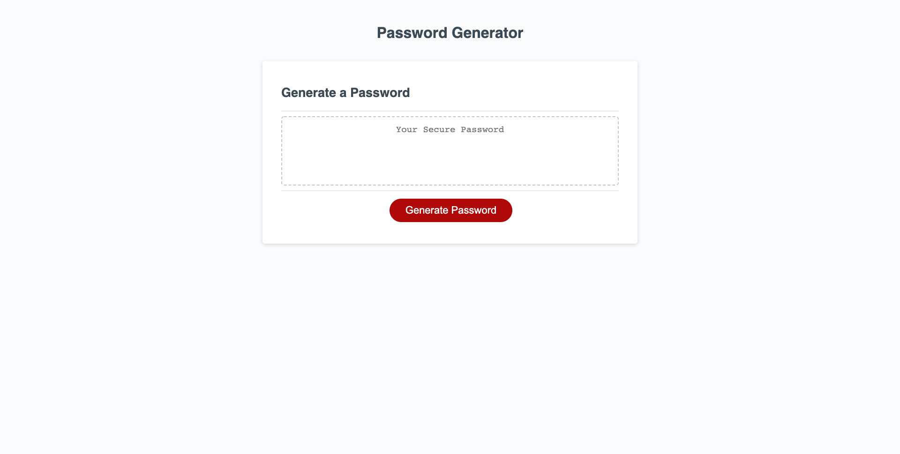

# **Password Generator**
***

## Table of Contents
1. [Description](#description)  
2. [Links](#links)  
3. [Visuals](#visuals)  
***

## Description
**Password Generator** enables employees to generate random passwords based on criteria that they’ve selected. This app runs in the browser and features dynamically updated HTML and CSS powered by JavaScript code that I have written. It has a clean and polished, responsive user interface that adapts to multiple screen sizes.

The app provides a numeric range that allows for them to select a number of characters for their password that is greater than or equal to 8 and less than or equal to 128. It also gives them the ability to use Lowercase Characters, Uppercase Characters, Numeric Characters & Special Characters. They may choose to omit character types. As long as they choose at least one character type, they can generate a password. 
***

## Links
[Link to Password Generator](https://mattholtmoore.github.io/password-generator-project/)

[Link to GitHub](https://github.com/mattholtmoore/password-generator-project)  
***

## Visuals

 